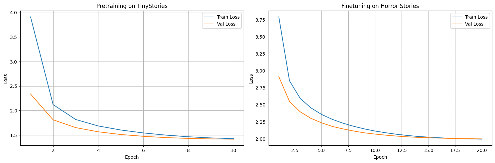
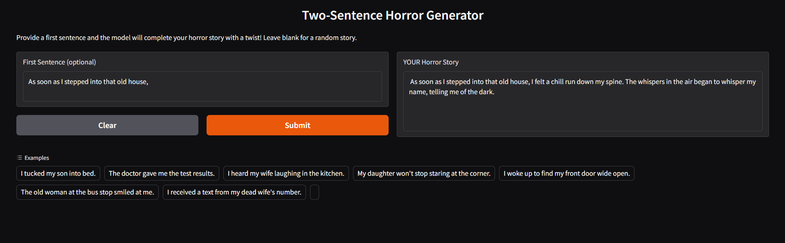
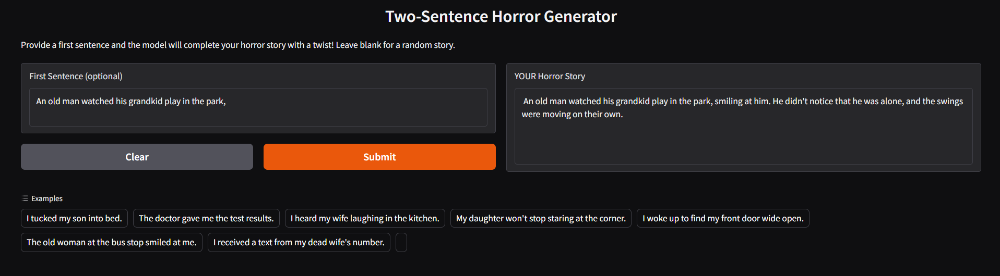
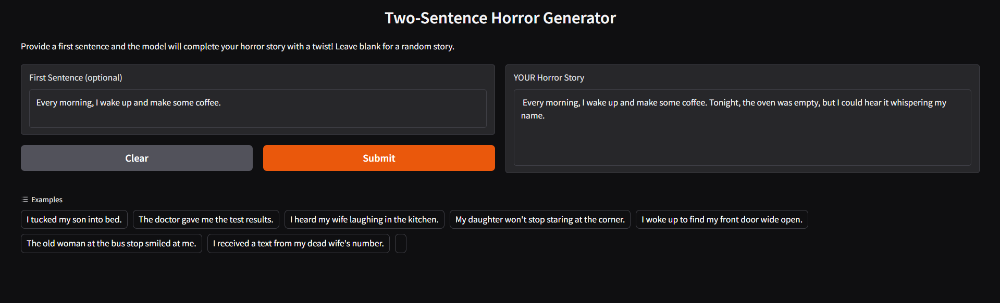
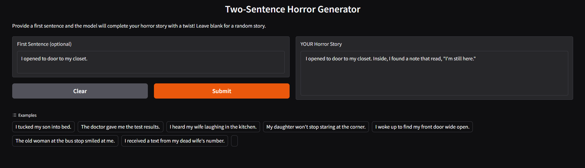
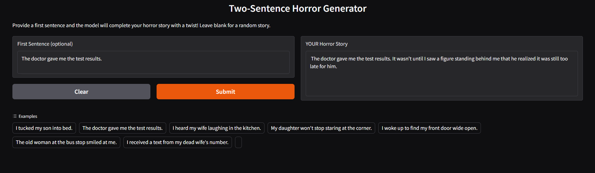
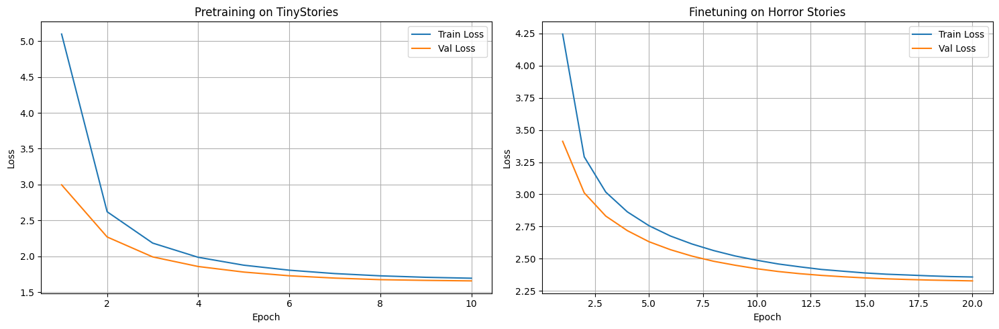

# Two-Sentence Horror Story Generator

A GPT-style decoder-only transformer built and trained from scratch to generate creepy two-sentence horror stories using a two-phase training approach: pretraining on clean narratives, then fine-tuning on synthetic horror data.

## NOTE

This model was scaled up for improved performance:
**Updated architecture:**
- Parameters: From 15.3M to **43M** (2.8× larger)
- Multi-Head Self-Attention (8 heads, 64 dim per head)
- Feed-Forward Network (512 -> 2048 -> 512)
- Dropout: 0.20 (To prevent overfitting with larger model)
- Weight decay during fine-tuning: 0.1

**Training results (scaled model):**
- Pretrain validation loss: 1.66 → **1.41** (15% improvement)
- Fine-tune validation loss: 2.33 → **1.99** (14.6% improvement)


<br><br>

**Impact on generation quality:** This improvement in loss shows in the examples with more coherent sentence structures and less nonsensical generations. Here are the examples for the same prompts with the bigger model:
- Prompt: 'I tucked my son into bed.'
Story:  I tucked my son into bed. As he turned off the light, he whispered, "Mommy, there's someone under my bed."

- Prompt: 'The doctor gave me the test results.'
Story:  The doctor gave me the test results. I was horrified to see the blood-red teeth on my hands, and it wasn’t mine anymore.

- Prompt: 'I heard my wife laughing in the kitchen.'
Story:  I heard my wife laughing in the kitchen. When she asked me why she was so happy, her voice replied from the kitchen.

- Prompt: 'My daughter won't stop staring at the corner.'
Story:  My daughter won't stop staring at the corner. I felt a chill when I saw her standing there, smiling wider than before.

- Prompt: [Random]
Story:  The neighborhood kids dared me to enter the abandoned house. When I stepped inside, they were all staring at me with hollow eyes

**Both model versions are available:**
- `TSH_Transformer_main.ipynb` - Original 15M parameter model
- `TSH_Transformer_biggermodel.ipynb` - Scaled 43M parameter model

The subsequent readme pertains to the older model but almost all of it is applicable for the bigger model as well. The only changes are listed above!

---

## Demo (smaller model)

### Example Generations

<br><br>

<br><br>

<br><br>

<br><br>

<br><br>


### The model does tend to generate stories that make no sense sometimes. This might be because of the model being small and a small training data subset:
Only a subset of 30M tokens were used out of the total 500M+ tokens in TinyStories due to compute cost concerns. Apart from the small pre-training subset, the fine-tuning dataset also had only ~50k samples (synthetic), generated using OpenAI's API and GPT-4o-mini
<br><br>



## Problem Statement

Generate grammatically correct two-sentence horror stories that:
- Follow proper narrative structure (setup -> twist)
- Are creative and avoid repetitive patterns

**Challenge:** Training language models from scratch typically requires massive datasets and compute. Small domain-specific datasets often lead to poor grammar, repetitive outputs, or nonsensical text.

## Model Architecture (smaller model)

Custom GPT-style decoder-only transformer built from scratch in PyTorch:

**Core Components:**
- **Token Embedding:** ~17.4K vocab -> 256 dimensions
- **Positional Embedding:** Learned positions up to 256 tokens
- **8 Transformer Blocks**, each containing:
  - Multi-Head Self-Attention (8 heads, 32 dim per head)
  - Feed-Forward Network (256 -> 1024 -> 256)
  - Layer Normalization
  - Residual connections
  - Dropout (0.15)
- **Output Head:** 256 → 17.4K vocab (next token prediction)

**Total Parameters:** ~15.3 million

**Key Design Choices:**
- Causal masking in attention (autoregressive generation)
- GELU activation (smooth, continuous gradients)
- Layer normalization before attention/FFN (pre-norm stabilizes training)
- Relatively small model size (enables training from scratch in ~1 hour)

## Training Strategy (smaller model)

### Phase 1: Pretraining on TinyStories

**Dataset:** 145K children's stories from TinyStoriesV2-GPT4 (https://huggingface.co/datasets/roneneldan/TinyStories)  
**Purpose:** Learn English grammar, sentence structure, and narrative structure  
**Configuration:**
- 10 epochs
- Learning rate: 3e-4 with cosine decay
- Batch size: 192 (Because I decided to use an A100! Lower if using T4 or L4)

**Results:**
- Training Loss: 1.6943
- Validation Loss: 1.6571
- **Outcome:** Model learns basic, grammatical English

### Phase 2: Fine-tuning on Synthetic Horror

**Dataset:** 47K synthetic horror stories (Which I generated using GPT-4o-mini and uploaded to Hugging Face)  
https://huggingface.co/datasets/sarthakmasta/TwoSentenceHorrorSynthetic      
**Purpose:** Adapt grammar knowledge narrative to horror-specific vocabulary and twist structures  
**Configuration:**
- 20 epochs with early stopping (early stopping was just a safety net, the validation loss kept going down till epoch 20)
- Learning rate: 2e-5 (very low to preserve our grammar pretraining)
- Batch size: 192
- Early stopping patience: 3 epochs

**Results:**
- Training Loss: 2.3575
- Validation Loss: 2.3272
- **Outcome:** Preserves grammar while learning horror patterns
- **Note:** The validation loss for fine tuning goes up drastically because the validation is done on a small subset of the fine-tuning horror dataset, and not because the model has forgotten the pretraining.

### Training and Validation Loss Curves (smaller model)


## Tokenization

**Custom BPE Tokenizer:**
- Vocabulary: 17,415 tokens (20k set as max)
- Trained on combined corpus: TinyStories (50K) + Synthetic Horror (50K)
- ByteLevel pre-tokenization
- Special tokens: `<PAD>`, `<BOS>`, `<EOS>`, `<UNK>`

## Generation Strategy

**Sampling Techniques:**
- Temperature: 0.4
- Top-k: 30
- Top-p(nucleus): 0.9
- Repetition penalty: 1.2

**How it works:**
1. User provides first sentence (or system picks random prompt)
2. Model generates tokens autoregressively
3. Stops at `<EOS>` token or 55 token limit
4. Decodes back to text

## The Development Journey

Started with 95K posts from r/TwoSentenceHorror (2015-2023 from Kaggle)   
https://www.kaggle.com/datasets/voanthony/two-sentence-horror-jan-2015-apr-2023   
I didn't plan on using TinyStories initially, just used this to train.

**What went wrong:**
- Dataset had severe quality issues:
  - Incomplete sentences
  - Inconsistent story structures + dataset size being too small to incorporate inconsistency
  - Varying lengths
- After aggressive filtering (30-42 tokens), only ~37K usable stories remained but still:   
- **Validation loss wouldn't drop below 4.11**     
- Some outputs were fine but most outputs were grammatically broken

**Money/Time Lost:** 
- ~$5 in GPU credits (multiple failed A100 training runs)
- Hours and hours of trying different model sizes, learning rates, etc.
- Tried small models (995k parameters), medium sized models (6M parameters) and large sized models (45M parameters), all failed to "understand" this dataset, with the best validation loss being 4.11, achieved by the 45M model. Training loss was going down constantly when using more epochs but that was just due to overfitting, the validation loss either plateaued or started increasing with more epochs.

**Key lesson:** Dataset quality matters A LOT.

**Solution:**
- I figured it would be better to pretrain on the TinyStories dataset so that the model learns grammar before trying to figure out horror patterns using the real dataset. The validation loss still did not go down at all.
- Tried freezing layers so that the grammar training isn't overwritten. That worsened the performance though.
- TinyStories gave me an idea to generate a TwoSentenceHorror dataset of my own. I used up $1 of my API credits on OpenAI platform and generated 50k synthetic samples of two sentence horror stories using the GPT-4o-mini. It took around 11 hours to generate all the 50k samples, using batches of 20 with one request.
- I tried mixing the 50k synthetic samples with the 37k filtered samples from the real dataset. Pretrained on TinyStories, then fine-tuned on the synthetic samples + real samples (I did jumble them around!). Performance did get better, with best validation loss as 3.49, but only a small percentage of the actually generated stories were coherent and made sense. Others did not make sense at all. I still wasn't happy.
- I decided to go with the only option in the end, ditching the real samples from the Kaggle dataset, and just using my synthetic dataset. The performance improved a whole lot, with validation loss dropping to 2.32.


## Unfiltered Actual Sample generations: (smaller model)
- Prompt: 'I tucked my son into bed.'   
Story:  I tucked my son into bed. As I turned off the light, he whispered, "Mommy, there's someone under my bed."   

- Prompt: 'The doctor gave me the test results.'   
Story:  The doctor gave me the test results. It was only after I finished that he realized he wasn't alone anymore.   

- Prompt: 'I heard my wife laughing in the kitchen.'   
Story:  I heard my wife laughing in the kitchen. It was only when she turned to look that I remembered her mother had died last year.   

- Prompt: 'My daughter won't stop staring at the corner.'   
Story:  My daughter won't stop staring at the corner. I turned to see her standing behind me, grinning widely.   

- Prompt: [Random]   
Story:  The old woman at the bus stop smiled at me. She had been dead for years, but the man in a face was smiling back at her from the empty street.   

**Review**
Some stories still don't make a lot of sense, but for a 16M model, this is very close to the absolute best it can do. Maybe 100M tokens from the TinyStories pretraining could have helped solidify the grammar, but the compute costs for that would be much higher.

## How to Run

### Prerequisites

You'll need:
- Google Colab (with GPU) or local GPU (Colab preferred because of A100 availability)
- Hugging Face account and token (for downloading synthetic data)
```bash
pip install -r requirements.txt
```

### Setup Hugging Face Token

The synthetic dataset requires authentication:

**You can set the token as a Colab secret**
```bash
HF_TOKEN = "your_huggingface_token"
```


Get your token at: https://huggingface.co/settings/tokens

### Running Training

1. Open `TSH_Transformer_main.ipynb` in Google Colab
2. Enable GPU: Runtime -> Change runtime type -> A100
3. Run cells sequentially
4. Training takes ~45 minutes on A100

**Checkpoints saved:**
- `pretrained_tinystories.pth` (after phase 1)
- `best_finetuned_horror.pth` (best validation loss during fine-tuning)
- `final_finetuned_horror.pth` (final model)

### Running Inference

After training completes, run the proceeding cells to:
- Generate test outputs
- Launch Gradio interface


## Datasets Used

1. **TinyStories-GPT4** ([Hugging Face](https://huggingface.co/datasets/roneneldan/TinyStories))
   - 150K stories for grammar pretraining
   - Clean, simple English narratives
   - Created by Microsoft Research

2. **Synthetic Horror Stories** ([Hugging Face](https://huggingface.co/datasets/sarthakmasta/TwoSentenceHorrorSynthetic))
   - 50K synthetically generated horror stories
   - Grammatically correct, format-consistent
   - Generated using GPT-4o-mini

3. **r/TwoSentenceHorror** (NOT USED - for reference only)
   - Original dataset from Kaggle (107K posts)
   - Quality issues made it unusable for training
   - Kept as reference for future improvements


## Future Improvements

- Add confidence scores to generation (perplexity-based)
- Increase the amount of data used for fine-tuning (Generating 50k more samples)
- Fine-tune on other creative writing domains (sci-fi microfiction, romance flash fiction)
- Deploy as public API with rate limiting
- Create interactive "story chain" mode (model generates first sentence, you write second, it continues)

## Technical Stack

- **Framework:** PyTorch
- **Tokenization:** Hugging Face Tokenizers (BPE)
- **Datasets:** Hugging Face Datasets
- **Interface:** Gradio
- **Visualization:** Matplotlib
- **Hardware:** NVIDIA A100 GPU (Google Colab)

## License

MIT License - Free for educational and research purposes.
